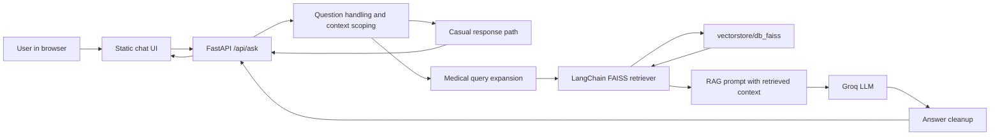
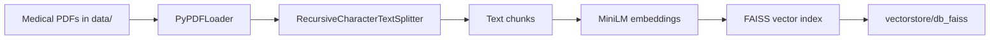

# MediBot: RAG Based Medical Reference Assistant

MediBot is a Retrieval Augmented Generation (RAG) based medical reference
assistant. Instead of relying only on a language model's general memory, MediBot
retrieves relevant passages from a curated medical knowledge base, injects that
retrieved context into the model prompt, and generates a clean educational
answer for the user.

The product is built as a full stack RAG application using FastAPI, LangChain,
Groq, HuggingFace sentence embeddings, and FAISS. It includes a polished
browser based chat interface, a local vector database, a medical safety prompt,
and deployment configuration for Render.

The current knowledge base is built from The Gale Encyclopedia of Medicine. The
retrieval layer searches this indexed reference corpus for relevant chunks, and
the generation layer uses those chunks to produce grounded medical explanations.
The UI intentionally hides raw retrieval snippets, page references, and citation
cards so the final product feels clean and professional.

MediBot is designed as an educational reference assistant. It is not a medical
diagnosis system, treatment engine, emergency triage system, or substitute for a
qualified healthcare professional.

## Product Overview

MediBot helps users ask medical reference questions in simple language while the
system handles retrieval, prompt assembly, answer generation, and response
cleanup behind the scenes. The app supports normal greetings, medical question
answering, follow up questions, and new chat sessions.

Key product behavior:

- Opens directly into a professional responsive chat UI at `/`
- Answers casual greetings normally without forcing retrieval or references
- Answers medical questions using a local Gale backed FAISS vector index
- Retrieves the most relevant chunks before calling the LLM
- Uses query expansion for medical shorthand such as `bp`
- Keeps responses clean, concise, and readable for end users
- Hides internal citations, page references, and retrieved snippets from the UI
- Maintains short conversation context for follow up questions
- Scopes follow up context to the latest medical topic
- Provides a New Chat button that clears current chat memory in the browser
- Includes a health endpoint for Render uptime checks
- Keeps generated API documentation disabled for a cleaner deployed product

## Why RAG

Medical reference applications need more control than a plain chatbot. A
general purpose LLM may answer from broad training data, but MediBot is designed
to answer from a specific indexed reference corpus.

RAG improves the product in four important ways:

- Grounding: answers are generated from retrieved medical reference chunks
- Freshness of corpus: the knowledge base can be rebuilt when source PDFs change
- Reduced hallucination risk: the model is instructed to use only retrieved
  context
- Better auditability: retrieval, generation, and answer cleanup are separate
  stages in the backend

The system still keeps the user experience simple. Users see a normal chat
interface, while the backend performs retrieval and generation invisibly.

## Technology Stack

### Backend

- Python 3.13.2
- FastAPI for the web server and API layer
- Uvicorn for ASGI serving
- Pydantic v2 for request and response validation
- python-dotenv for local environment variable loading
- CORS middleware for controlled API access

### AI and RAG

- LangChain for the RAG orchestration layer
- LangChain retriever abstraction for semantic search over FAISS
- LangChain document combination chain for injecting retrieved context
- LangChain Groq integration for LLM calls
- Groq hosted model, defaulting to `openai/gpt-oss-20b`
- HuggingFace sentence embeddings with `sentence-transformers/all-MiniLM-L6-v2`
- FAISS for local vector search
- PyPDF document loading for the source encyclopedia PDF
- Recursive text splitting for chunking the medical reference corpus

### Frontend

- Static HTML, CSS, and vanilla JavaScript
- Responsive two column desktop layout with mobile support
- Manrope font from Google Fonts
- Session storage for browser side chat continuity
- Fetch based integration with the FastAPI `/api/ask` endpoint

### Deployment

- Render Web Service
- Hugging Face Spaces with Docker
- `render.yaml` infrastructure configuration
- Health checks via `/health`
- Runtime environment variables for secrets and model selection

## Architecture



## RAG Pipeline

MediBot has two RAG phases: offline indexing and online question answering.

### 1. Offline Indexing

The vector store is built before the app answers questions.



Indexing steps:

1. Load source PDFs from `data/`
2. Split PDF text into smaller overlapping chunks
3. Convert chunks into dense vectors using HuggingFace embeddings
4. Store vectors and document metadata in FAISS
5. Persist the FAISS index locally under `vectorstore/db_faiss`

### 2. Online Retrieval And Generation

When a user asks a medical question, MediBot does not send the question directly
to the LLM as a standalone prompt. It first retrieves relevant reference
material.

Question Answering steps:

1. The user submits a message from the browser.
2. The frontend stores recent chat messages in `sessionStorage`.
3. For new medical topics, the frontend sends the new question without old
   topic history.
4. For follow up questions, the frontend sends recent scoped context.
5. FastAPI validates the request with Pydantic.
6. Casual greetings are answered directly.
7. Medical questions are expanded when useful, for example `bp` becomes
   `blood pressure hypertension high blood pressure`.
8. The expanded query is embedded and searched against FAISS.
9. LangChain retrieves the top relevant chunks from the medical index.
10. Retrieved chunks are inserted into the RAG prompt as context.
11. The scoped conversation is included only when the question is a follow up.
12. Groq generates the final answer from the retrieved context.
13. The backend cleans markdown, source labels, page labels, and encyclopedia
    references before returning the answer.
14. The UI displays only the final clean response.

## Retrieval Strategy

The current retrieval configuration uses:

- Embedding model: `sentence-transformers/all-MiniLM-L6-v2`
- Vector database: FAISS
- Retriever top k: `3`
- Chunk size: `500`
- Chunk overlap: `50`
- Knowledge base path: `data/`
- Persisted index path: `vectorstore/db_faiss`

The backend also includes medical query expansion for common short forms and
topic terms. For example:

```text
bp -> blood pressure hypertension high blood pressure
heart attack -> myocardial infarction heart attack
throat infection -> sore throat tonsillitis pharyngitis throat infection
```

This improves retrieval quality when users ask short or informal medical
questions.

## Context Handling

MediBot uses conversation context carefully. It does not blindly send the entire
chat history into every RAG call.

- Standalone medical questions start a new retrieval context
- Short follow up questions can use recent topic specific history
- New medical topics reset the context window
- Browser side history is limited to the latest messages
- Backend side context is scoped to the latest detected medical topic

This keeps responses focused. For example, if a user asks about fever and then
switches to throat infection, a later question like "tell me its treatment" is
treated as a throat infection follow up, not a fever follow up.

## Repository Structure

```text
.
|-- app.py                       # FastAPI app, UI serving, API routes, RAG logic
|-- create_memory_for_llm.py      # Builds vectorstore/db_faiss from PDFs
|-- connect_memory_with_llm.py    # CLI helper for asking the RAG chain directly
|-- data/                         # Source medical PDF files
|-- static/
|   |-- index.html                # Main chat interface
|   |-- styles.css                # Responsive UI styling
|   |-- app.js                    # Chat behavior, API calls, browser memory
|   `-- favicon.svg               # Browser tab icon
|-- vectorstore/db_faiss/         # Persisted FAISS index
|-- requirements.txt              # Python dependencies
|-- render.yaml                   # Render deployment configuration
|-- .python-version               # Python version target
|-- .env.example                  # Environment variable template
`-- README.md
```

## Core Files

### `app.py`

The main application file. It contains:

- FastAPI initialization
- Static frontend serving
- `/api/ask`, `/ask`, `/health`, and `/` routes
- LangChain RAG chain creation
- FAISS loading
- Groq model setup
- Medical query expansion
- Conversation scoping
- Casual response handling
- Answer cleanup and safety formatting

### `create_memory_for_llm.py`

Builds the RAG vector database from PDFs in the `data/` directory.

Process:

1. Load PDF documents from `data/`
2. Split text into chunks
3. Embed chunks with `sentence-transformers/all-MiniLM-L6-v2`
4. Store the vectors locally in `vectorstore/db_faiss`

### `connect_memory_with_llm.py`

A lightweight CLI helper for testing retrieval and generation outside the
browser UI.

### `static/`

Contains the full frontend. The app intentionally avoids a framework so the UI
is simple to deploy with FastAPI and Render.

## API Reference

Generated FastAPI docs are disabled in production style configuration. The
supported endpoints are listed here.

### `GET /`

Serves the MediBot chat UI.

### `GET /health`

Returns service status for Render health checks.

Example response:

```json
{
  "status": "ok",
  "vectorstore_ready": true,
  "model": "openai/gpt-oss-20b"
}
```

### `POST /api/ask`

Primary chat endpoint used by the frontend.

Request:

```json
{
  "question": "What are common symptoms of asthma?",
  "history": [
    {
      "role": "user",
      "content": "I have breathing difficulty"
    },
    {
      "role": "assistant",
      "content": "Educational response from MediBot."
    }
  ]
}
```

Response:

```json
{
  "question": "What are common symptoms of asthma?",
  "answer": "Asthma may cause wheezing, coughing, chest tightness, and shortness of breath. Symptoms can vary by person and may worsen with triggers such as exercise, respiratory infections, allergens, or irritants.\n\nThis information is educational and not a substitute for care from a qualified medical professional.",
  "sources": []
}
```

The `sources` field is kept for API compatibility, but the current product
intentionally returns an empty list so the UI remains clean and citation free.

### `POST /ask`

Legacy compatibility endpoint. It accepts the same request and returns the same
response shape as `/api/ask`.

## Environment Variables

Create a local `.env` file from `.env.example`.

```bash
cp .env.example .env
```

Required values:

```text
GROQ_API_KEY=your_groq_api_key_here
GROQ_MODEL_NAME=openai/gpt-oss-20b
```

Optional value:

```text
HF_TOKEN=your_huggingface_token_here
```

Notes:

- `.env` must never be committed to Git.
- `.env.example` is safe to commit because it contains placeholders only.
- Render should store `GROQ_API_KEY` as a protected environment variable.

## Local Development

Use Python 3.13.2.

```bash
cd /Users/maharshipandya/Documents/GenAi_Projects/MediBot
python -m venv .venv
source .venv/bin/activate
pip install -r requirements.txt
cp .env.example .env
```

Add your Groq API key to `.env`, then start the app:

```bash
uvicorn app:app --reload
```

Open:

```text
http://127.0.0.1:8000
```

## Rebuilding The Vector Store

The committed app expects the FAISS index at:

```text
vectorstore/db_faiss
```

If the medical PDFs in `data/` change, rebuild the index:

```bash
python create_memory_for_llm.py
```

Expected outputs:

```text
vectorstore/db_faiss/index.faiss
vectorstore/db_faiss/index.pkl
```

Security note: LangChain FAISS persistence stores document metadata using
pickle. This app enables FAISS deserialization because it loads its own trusted
local vector store. Do not load a FAISS index from an untrusted source.

## Hugging Face Spaces Deployment

This project includes Docker support for Hugging Face Spaces.

Recommended Space settings:

```text
SDK: Docker
Hardware: CPU Basic
Visibility: Public or Private
App Port: 7860
```

Required Space secrets:

```text
GROQ_API_KEY=your_groq_api_key_here
GROQ_MODEL_NAME=openai/gpt-oss-20b
HF_TOKEN=your_huggingface_token_here
```

The Docker container starts FastAPI with:

```bash
uvicorn app:app --host 0.0.0.0 --port 7860
```

The root Space URL should open the MediBot chat UI. The health endpoint remains:

```text
/health
```

## Render Deployment

This repository also includes `render.yaml` for Render Web Services.

Render settings:

```text
Runtime: Python
Build Command: pip install -r requirements.txt
Start Command: uvicorn app:app --host 0.0.0.0 --port $PORT
Health Check Path: /health
```

Required Render environment variables:

```text
GROQ_API_KEY=your_groq_api_key_here
GROQ_MODEL_NAME=openai/gpt-oss-20b
PYTHON_VERSION=3.13.2
```

## Requirements

The project uses a broad dependency set because it includes the web server,
LangChain, Groq, FAISS, HuggingFace embeddings, PDF loading, and ML runtime
packages.

Important dependencies:

- `fastapi`
- `uvicorn`
- `pydantic`
- `langchain`
- `langchain-community`
- `langchain-core`
- `langchain-groq`
- `langchain-huggingface`
- `groq`
- `faiss-cpu`
- `sentence-transformers`
- `transformers`
- `torch`
- `pypdf`

The dependency set has been checked locally in Python 3.13 with:

```bash
python -m pip check
```

## Safety And Product Boundaries

MediBot is intentionally conservative. It should:

- Provide educational medical reference information
- Avoid claiming to diagnose a user
- Avoid creating a personalized treatment plan
- Encourage professional medical care for personal decisions
- Encourage emergency care for urgent symptoms
- Avoid exposing raw retrieval artifacts in normal chat responses

Emergency examples include severe breathing trouble, chest pain, stroke like
symptoms, severe allergic reaction, heavy bleeding, fainting, or thoughts of
self-harm.

## Known Limitations

- The answer quality depends on the available indexed medical reference content.
- If the FAISS index does not contain relevant information, the app should avoid
  inventing an answer.
- The UI stores conversation history in browser `sessionStorage`, not a database.
- The app does not include authentication or user accounts.
- The app does not provide real time medical triage.
- The current API keeps `sources` as an empty list for a cleaner product
  experience.

## License And Disclaimer

This project is for educational and portfolio use. The medical content and any
source PDFs used to build the vector store must be used according to their
respective licenses and permissions.

MediBot is not a substitute for professional medical advice, diagnosis, or
treatment. Users should consult a qualified healthcare professional for personal
medical decisions and seek emergency services for urgent symptoms.
